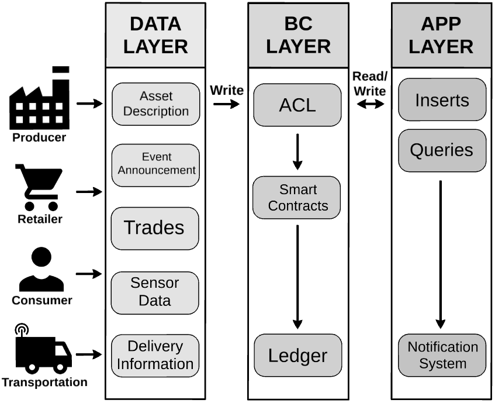

# ChainSCAN
This repository contains the components of ChainSCAN, a fully decentralized blockchain-based supply chain management system, that manages, regulates and records activities in food supply chain. ChainSCAN is formed for the collaboration of 4 blockchain organizations known as producer, retailer, consumer and transportation. Furthermore, the application functionality is divided into 4 smart contracts:
* Asset contract: manages and supports every activity related to physical assets (i.e., create asset, transfer ownership of asset, etc.)
* Trade contract: supports and tracks trade events for each asset. The act of trading includes moving the ownership of assets from one owner to another. 
* Transport contract: regulate and manage asset shipment while providing package tracking information.
* Ownership contract: maintains the records of ownership for existing assets and generates new owners into ChainSCAN.
<p align="center">
  
</p>

## Getting Started
1. Install the following software and packages:
    - Docker & Docker Compose.
    - NodeJS & NPM.
1. Clone and deploy [Blockchain_Manager](https://github.com/jacastillo8/Blockchain_Manager) tool.
1. Move all 4 smart contract folders to `Blockchain_Manager/blockchain_base/chaincode` so that the smart contracts can be properly instantiated in the blockchain.
1. Load collection `postman_collection_chainhealth` into Postman.
    - Register ChainHealth blockchain (`Register`), which includes 3 organizations denoted as Hospital X, Clinic Y and Research Z.
    - Build ChainHealth blockchain (`Build`). Large blockchains may require larger times to deploy, thus, to avoid sending multiple build requests while waiting, just cancel the request after sending it. The blockchain will continue to deploy in the background. 
1. Navigate to `express_app` folder and install node dependencies.
    ```bash
    cd express_app
    npm install
    ```
1. Add/modify information from `config.yaml` (found inside `express_app`), i.e., change host/port values for each component, etc. The current file matches the number of organizations of the built blockchain. 
1. You are now ready to deploy ChainHealth.
